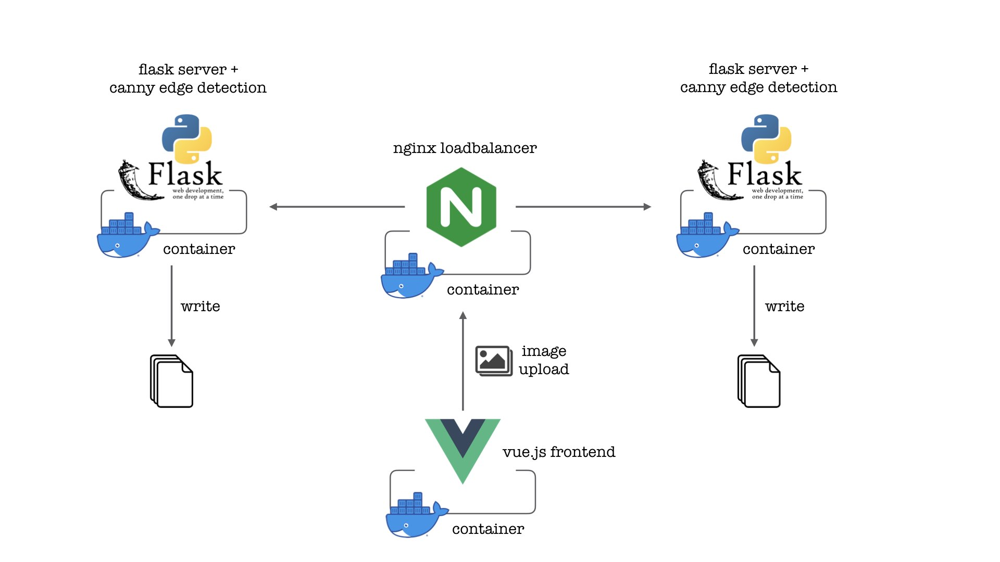
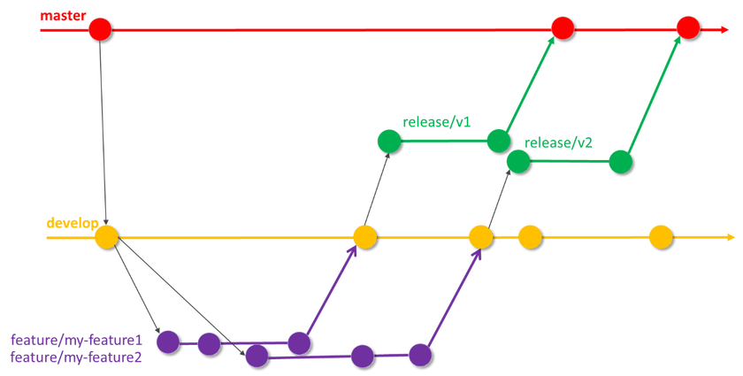
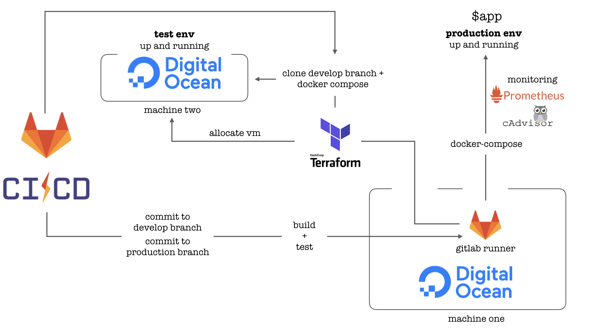

# Showcase of a DevOps infrastructure 
### (!) Designed for a GitLab CI/CD pipeline (!)
### Onboarding
Entrypoint to my infrastructure is a **GitLab repository**, and the **.gitlab-ci.yml file** forms the core of my automation process. From GitLab the application is deployed into two environments - test and production. While the production environment represents a **continuously running server**, test environment should only be allocated and set up if needed. **DigitalOcean** is chosen as the cloud service provider in this solution.

### High level file structure
```bash
.
├── .gitlab-ci.yml                  # Defines the sequence of test and deployment \
|                                   # pipeline in both environments
├── /app 
|   ├── /frontend                   # Vue.js application 
|   ├── /load_balancer              # Nginx container and configuration files
|   ├── /logic                      # Python application and Flask server
|   ├── docker-compose.yml          # App-container-composition including monitoring
|   └── prometheus.yml              # Configuration of monitoring
├── /allocate
|   ├── provider.tf                 # Terraform digitalocean configuration
|   ├── spin_up_machine.tf          # Terraform vm allocation and provisioning
|   └── /provisioning_machine_one    
|       ├── dependencies.sh         # Install dependencies on machine one
|       ├── installTF.sh            # Terraform installation
|       └── setUpRunner.sh          # Install GitLab-Runner on machine one
├── /assets
└── README.md
```

### Application - Canny Edge Detection as a Python Service
The app used in this exercise consists of **three micro services** that work together in **Docker containers**. The containers with the services are build and run in a **docker-compose.yml** together with monitoring tools. (Monitoring not in chart but in architecture, see below) 


The aim of the application is to apply a **Canny edge detection** to an image and to provide this task as an online service. The first micro service is a simple **web frontend** mapped on port 80, that allows the user to access the application under http://886709.de and upload images. For sending images the **sendImage()** function is responsible.

"/app/frontend/src/components/ImageForm.vue":
```javascript
sendImage() {
    let data = new FormData();
    data.append('file', this.image, 'image.jpg');
    var request = new XMLHttpRequest();
    request.open('POST', `${this.apiUrl}${this.apiPort}`);
    request.send(data);
    ...
},
```

After the upload/request from the frontend, the images are routed to a **NGINX** container, which acts as a **load balancer**. The NGINX not only distributes the requests, it also ensures **horizontal scalability** of the application via **hash_ip** (sticky session is only available for nginx pro). 

"/app/load_balancer/nginx.conf":
```bash
upstream backend {
    # ip_hash for horizontal scalability
    ip_hash;
    server backend1:5000;
    server backend2:5001;
}
```

Two backend logic units process the requests with a **Python flask** interface and execute the canny algorithm on the image. The result image is written via a mounted volume to the file system of the host server, where it can be retrieved from the frontend by the **fetchImages()** function.

"/app/frontend/src/components/ImageForm.vue":
```javascript
fetchImages() {
      var request = new XMLHttpRequest();
      var self = this;
      // HTTP request to fetch image locations
      request.open('GET',`${this.apiUrl}${this.dataPort}/fetch`);
      request.send();

        ...
          
          // load images from backend
          for (let i in test) {
            image_list.push(`${self.apiUrl}${self.dataPort}/static/${test[i]}`);
          }
          self.images = image_list;
        
        ...
        
    }     
``` 

**To build & run application:**
```bash
# build application & monitoring
docker-compose -f ./app/docker-compose.yml build

# run application & monitoring
docker-compose -f ./app/docker-compose.yml up -d
```
**"$ docker ps" when application is running:**
```bash
root@machine-one:$ docker ps
CONTAINER ID        IMAGE                          PORTS                        NAMES
2d773ea16597        google/cadvisor:latest         0.0.0.0:8080->8080/tcp       cadvisor
c8972a5f2743        app_frontend                   0.0.0.0:80->8080/tcp         app_frontend_1
776010a6f75a        app_loadbalancer               0.0.0.0:3000->80/tcp         app_loadbalancer_1
95a6b0c46548        app_backend2                   0.0.0.0:5001->5000/tcp       app_backend2_1
ab362ee8f982        app_backend1                   0.0.0.0:5000->5000/tcp       app_backend1_1
862fc49ab3f6        prom/prometheus:latest         0.0.0.0:9090->9090/tcp       prometheus
```

### Trigger Automation
The deployment process is triggered by two events in the source code management system. This is based on a **release branching strategy** (see chart below). If a developer is working on a new feature or is fixing a bug, he is working on an individual branch. When the feature is finished it is merged/commited on the developement branch. This is a trigger and runs the first pipeline. The new feature must now be put through its paces. Therefore the current version of the application is deployed to the **test environment**. 
When a dedicated set of features is meant to be published, the current state of the development branch is a new release. When the release has passed all tests and is ready for production, the app now can be distributed into the **production environment**. This is done by a merge/commit (push) to the release branch (production branch in this example). An overview of the exact steps follows in the next paragraphs. 
PS: We always want a flawless running version in the master branch.

*http://writeabout.net/2018/05/04/git-branching-guidance-for-devops-teams*

### Continuous Integration
Continuous integration is the first part of the automation process and aims to deliver an executable image of the application. The GitLab CI Tool offers the possibility to configure various steps of the pipeline. As mentioned in the "Application" paragraph, the app is built as containers organized in a docker-compose file. So they share a network among the services, although the ports and mounts are exposed to the host system for accessibility. 
```yml
...

services:
    frontend:
        ...
        ports:
            - '80:8080'

    backend1:
        ...
        ports:
            - '5000:5000'
    backend2:
        ...
        ports:
            - '5001:5000'

    loadbalancer:
        ...
        ports:
            - '3000:80'

    prometheus:
        ...
        ports:
            - '9090:9090'
        ...

    cadvisor:
        ...
        ports:
            - '8080:8080'
        ...
    
```
If the builds run smoothly and the **test stage** don't return any errors, the Docker images for each microservice are now ready to be executed on the permanently online server, **machine one**. All commands for setting up and configurate machine one are documented in scripts under "/allocate/provisioning_machine_one". This step is almost equal for both environments - with the only difference that in the test environment the build will happen by a Terraform provisioning job, that was started in the pipeline before. 
For details see "/allocate/spin_up_machine.tf".


### Continuous Deployment
From now on the distribution for test and production environment will differ. Both processes activate a **GitLab runner** in isolated build directories on the target server, machine one, but since the pipeline into the production branch has already passed through all tests, **runner one** can shut down the Docker composition currently running on machine one and run the new containers instead. Finally, the new version of the frontend can be accessed in the production environment via the FQDN - 886709.de. This constitutes the **production environment**. 

As the test environment does not exist yet, **runner two** has to start a new server, **machine two**, first. A **Terraform** process in it's pipeline spins up a second digitalocean droplet, **machine two**. When machine two answers "online", the runnder logs in with a SSH key stored on machine one. Then the still running terraform sequence clones the development branch from the GitLab repository and runs the already known docker-compose commands. On the now operating **test environment** user tests can be performed on the application. 

"/allocate/spin_up_machine.tf":
```yml
    provisioner "remote-exec" {
        inline = [
            ...
            # clone project using gitlab deploy token
            "git clone --single-branch --branch develop \
                http://gitlab+deploy-token-22:<deploy_token>@gitlab./user_name/repo_name.git",
            ...

            # use develop-compose file for configuration
            "docker-compose -f ./app/develop-compose.yml build",
            "docker-compose -f ./app/develop-compose.yml up -d",
            
            ...
        ]
  }
```


### Monitoring
The containerized application is monitored during runtime by **cAdvisor** (short for container Advisor) in combination with **Prometheus**. cAdviser analyzes and exposes resource usage and performance data from running containers. cAdvisor provides Prometheus metrics out of the box. Stats and graphs for specific Docker containers can be explored in the browser under **"http://localhost:8080/docker/container-name"** (e.g. http://machine_one_IP:8080/docker/frontend). Both monitoring tools, cAdvisor and Prometheus, are run together with the application in the docker-compose, so they share a network.

### Architecture



